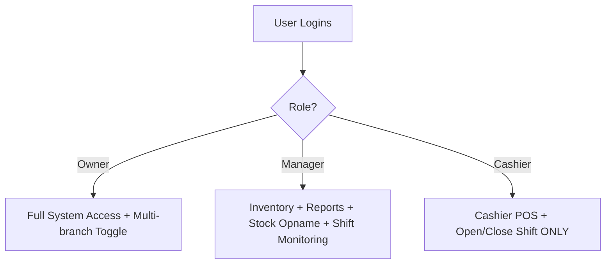
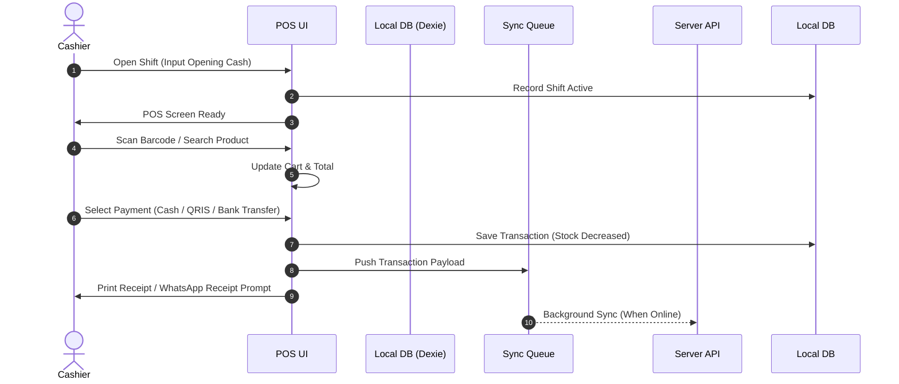
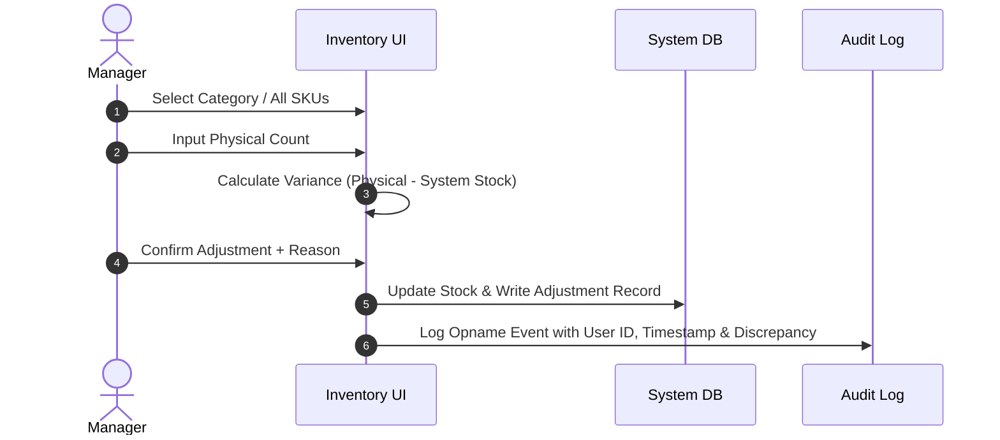
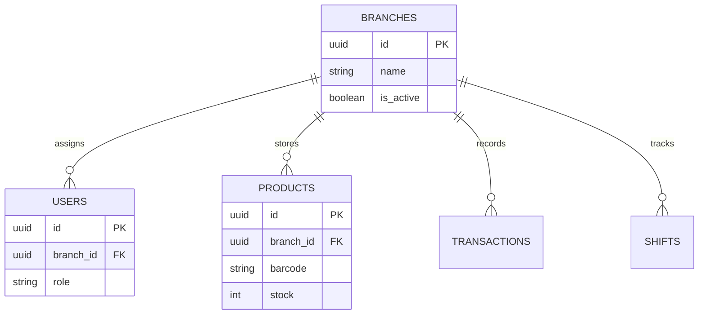

# Product Requirement Document (PRD)
## RetailFlow POS - Modern Web-Based Point of Sale System

**Document Version:** 1.0.0  
**Document Status:** Approved & Final (Single Source of Truth)  
**Project Name:** RetailFlow POS  
**Target Business:** Small Minimarket (Single Store, Multi-Branch Expansion Ready up to 2–3 Branches)  

---

## 1. Executive Summary & Vision

### 1.1 Executive Summary
RetailFlow POS is a commercial, modern, mobile-first, offline-ready Point of Sale (POS) and Retail Management System tailored for small minimarkets. It eliminates the friction of traditional bulky desktop POS software by delivering a blazingly fast, touch-optimized web experience that operates seamlessly both online and offline.

RetailFlow POS integrates essential retail workflows—touch cashiering, real-time stock calculation, stock opname, purchase order stock increases, financial tracking, automated WhatsApp receipt generation, audit logging, and read-only AI business insights powered by Gemini AI.

### 1.2 Strategic Objectives
* **Cashier Efficiency:** Enable cashiers to complete checkout transactions in under 15 seconds with zero learning curve (< 10 minutes onboarding).
* **Offline Resilience:** Guarantee 100% operation continuity during internet outages with IndexedDB local caching and automatic background synchronization.
* **Inventory Control:** Eliminate inventory drift through automated real-time stock deductions, stock opname reconciliation, expiration alerts, and damaged item logging.
* **Financial Transparency:** Provide immediate, audit-backed clarity into gross profit, net profit, opening/closing cash differences, and expense tracking.
* **AI Business Intelligence:** Deliver read-only actionable predictive restock recommendations, dead stock identification, and sales trend analysis without risking database integrity.
* **Future-Proof Multi-Branch Scalability:** Built from day one with multi-branch schema and branch ID isolation, kept dormant until activated by the Store Owner.

---

## 2. Target Business Profile & Architecture Scope

### 2.1 Store Profile
* **Current Scale:** Single Store Minimarket with 1–3 cashier registers.
* **Product Catalog Size:** 500 to 10,000 SKUs (Barcoded & Non-barcoded fast-moving consumer goods).
* **Future Scale:** Expansion to 2–3 store branches.

### 2.2 Architectural Scope Constraints
* **Multi-Branch Capability:** Database and state management include a mandatory `branch_id` field. All queries filter by active `branch_id`. Multi-branch switching UI remains completely hidden/disabled for Cashiers and Managers, and is toggleable only in Owner Settings.
* **Offline-First Paradigm:** All operational cashier, stock, shift, and sales data are duplicated locally in IndexedDB using Dexie.js.

---

## 3. Responsive & UX Philosophy (Mobile-First Mandate)

### 3.1 Design Principles
1. **Mobile First & Touch Optimized:** Engineered primarily for Android phones, iPhones, tablets (iPad/Android), and desktop displays.
2. **10-Minute Cashier Mastery:** Minimal visual noise, large primary touch targets (minimum 48px height), high contrast colors, and ergonomic spacing.
3. **No Mouse Hover Reliance:** Every interaction is touch-driven (taps, slide drawers, bottom sheets, full-screen modals).
4. **Anti-Slop Modern Aesthetic:** Clean neutral slate palette with deliberate visual hierarchy, emerald status indicators, and zero artificial clutter.

### 3.2 Responsive Component Rules
| Component | Desktop Layout | Tablet Layout | Mobile Layout (Phone) |
| :--- | :--- | :--- | :--- |
| **POS Checkout** | Split 2-Column (Catalog + Cart) | Split 2-Column | Toggleable Bottom Sheet / Fullscreen Cart |
| **Data Tables** | Multi-column grid | Compact grid | Expandable Cards / Drawer Details |
| **Modals / Forms** | Centered Modal Dialog | Centered Modal Dialog | Full-screen Slide-up Drawer / Bottom Sheet |
| **Navigation** | Fixed Top Bar / Sidebar | Collapsible Drawer | Fixed Bottom Action Bar / Slide Menu |

---

## 4. User Roles & RBAC Matrix

Only **three roles** exist in RetailFlow POS. Permissions are strictly enforced both client-side and server-side.

### 4.1 Detailed RBAC Matrix

| Permission / Action | Owner | Manager | Cashier |
| :--- | :---: | :---: | :---: |
| **Open & Close Shift** | Yes | Yes | Yes |
| **Process POS Checkout** | Yes | Yes | Yes |
| **Apply Cart Discount** | Yes | Yes (Up to Limit) | No (Preset Promo Only) |
| **View Daily POS Sales Summary** | Yes | Yes | Shift Summary Only |
| **Add / Edit / Delete Products** | Yes | Yes | No |
| **Edit Product Cost / Purchase Price** | Yes | Yes | No |
| **Purchase Stock (Inbound)** | Yes | Yes | No |
| **Stock Opname Reconciliation** | Yes | Yes | No |
| **Log Damaged / Expired Goods** | Yes | Yes | No |
| **View Gross & Net Profit** | Yes | Owner-approved | No |
| **Manage Users & Roles** | Yes | No | No |
| **View Audit Logs** | Yes | Read-Only | No |
| **System Settings & Multi-Branch Activation** | Yes | No | No |
| **AI Assistant Access** | Yes | Yes | No |

---

## 5. Core Operational Workflows & Flowcharts

### 5.1 Cashier Shift & Sales Sequence

### 5.2 Stock Opname Sequence

---

## 6. Comprehensive Module Requirements

### 6.1 Dashboard Module
* **Purpose:** Provides real-time operational overview tailored per user role.
* **Key Metrics:** Daily Revenue, Transaction Count, Average Basket Value, Low Stock Alerts, Expiry Warnings.
* **Visual Widgets:** Sales Trend Chart (Recharts), Top 5 Selling SKUs, Fast Expense Quick-Add.

### 6.2 Cashier POS Module
* **Workflow:** Open Shift -> Input Opening Cash -> Scan/Search -> Add Cart -> Quantity Adjust -> Select Payment -> Cash Change Calculation -> Complete Transaction -> Print/WhatsApp Receipt -> Close Shift.
* **Restrictions:** Cashier CANNOT edit product prices, stock levels, system settings, or view financial profit metrics.

### 6.3 Product Management Module
* **Product Attributes:** Barcode, Name, Brand, Category, Description, Purchase Price (Cost), Selling Price, Tax Rate, Current Stock, Minimum Stock Alert, Expiration Date, Supplier Info.
* **Automatic Calculations:**
  * $\text{Gross Profit} = \text{Selling Price} - \text{Purchase Price}$
  * $\text{Margin \%} = \left(\frac{\text{Selling Price} - \text{Purchase Price}}{\text{Selling Price}}\right) \times 100\%$

### 6.4 Inventory Management & Stock Opname Module
* **Inbound Stock Purchase:** Increases stock, updates last purchase price, records supplier transaction.
* **Outbound Sales:** Automatically decreases stock upon completed receipt.
* **Stock Opname:** Reconciles physical inventory with database records; variance triggers automatic stock adjustment and non-deletable audit log entries.
* **Damage & Expiry Logging:** Deduced from available stock with expense classification.

### 6.5 Promotion Management Module
* **Promo Types:** Percentage Discount, Fixed Amount Discount, Buy X Get Y.
* **Constraints:** Start/End date validation, Minimum purchase thresholds, Usage limits.

### 6.6 Customer Management & WhatsApp Receipt
* **Customer Fields:** Name, WhatsApp Number (E.164 format e.g., +62...).
* **WhatsApp Integration:** Generates formatted receipt link with pre-filled message launching WhatsApp Web/App.

### 6.7 Finance & Cashflow Module
* **Cash Tracking:** Opening Cash, Closing Cash, Cash In (Petty Cash deposit), Cash Out (Expenses/Withdrawals), Expected Cash vs Actual Cash difference calculation.
* **P&L Summary:** Gross Revenue, Cost of Goods Sold (COGS), Operating Expenses, Net Profit.

### 6.8 Reports Module
* **Filtering:** Daily, Weekly, Monthly, Yearly, Custom Date Ranges.
* **Reports Generated:** Sales Report, Product Profitability Report, Inventory Valuation Report, Expired SKU Report, Cashier Shift Performance Report, Slow-Moving SKU Report.

### 6.9 Audit Log Module
* **Non-Deletable Ledger:** Every login, shift open/close, stock manual adjustment, price edit, promotion modification, and discount overrides are recorded with User ID, Timestamp, IP Address, and Old vs New values.

### 6.10 AI Assistant Module (Gemini Read-Only Intelligence)
* **Model:** `@google/genai` using `gemini-3.6-flash`.
* **Guardrails:** Strictly READ-ONLY. AI is forbidden from executing direct SQL mutations or data updates.
* **Features:**
  * **Predictive Restock Alert:** Identifies SKUs projected to run out based on sales velocity.
  * **Dead Stock Identification:** Lists products with zero movement over 30 days.
  * **Peak Hour Analysis:** Identifies busiest cashier hours for optimal staffing.

### 6.11 Offline-First & Background Sync Engine
* **Technology:** IndexedDB managed via Dexie.js.
* **Queue Strategy:** Outgoing transactions are saved to a `sync_queue` table with status `PENDING`.
* **Sync Engine:** Service Worker & online event listeners process `PENDING` queue items in sequential FIFO order upon reconnection.
* **Conflict Resolution:** Last-Write-Wins with server timestamp verification. Double-deduction prevention using unique client-generated Transaction UUIDs (`tx_uuid`).

---

## 7. Business & Validation Rules Matrix

| Rule ID | Module | Rule Description | Edge Case / Failure Handling |
| :--- | :--- | :--- | :--- |
| **BR-001** | POS | Cashier must open shift before entering POS. | POS screen redirects to "Open Shift" dialog if active shift ID is missing. |
| **BR-002** | Inventory | Stock cannot go negative during offline sale. | System allows transaction but flags item as "Negative Stock Pending Verification". |
| **BR-003** | Audit | Audit logs cannot be updated or deleted by any user. | Database constraints & API routes reject `PUT`/`DELETE` operations on audit tables. |
| **BR-004** | Shift | Closing cash difference must be calculated explicitly. | $\text{Difference} = \text{Actual Closing Cash} - (\text{Opening Cash} + \text{Cash Sales} + \text{Cash In} - \text{Cash Out})$. |
| **BR-005** | Product | Selling Price must be greater than or equal to Purchase Price. | UI highlights negative margin warning; requires Manager/Owner confirmation. |

---

## 8. Non-Functional Requirements

* **Performance:** POS page load time < 1.0s. Barcode scan-to-cart latency < 50ms.
* **Security:** Password hashing with Argon2/bcrypt, HTTP-only JWT cookies, strictly enforced RBAC.
* **Availability:** 99.9% uptime with offline fallback guarantee.
* **Accessibility:** Touch target size $\ge 48\times48\text{ px}$, WCAG AA contrast compliance.

---

## 9. Future Multi-Branch Expansion Architecture

When multi-branch mode is inactive (`is_multi_branch = false`), `branch_id` defaults to `default-branch-001`.

---

## 10. Document Approval & Sign-Off
* **Product Owner:** Principal Product Manager (RetailFlow)
* **Lead Architect:** Principal Software Architect
* **Status:** Finalized & Ready for Technical Build.
