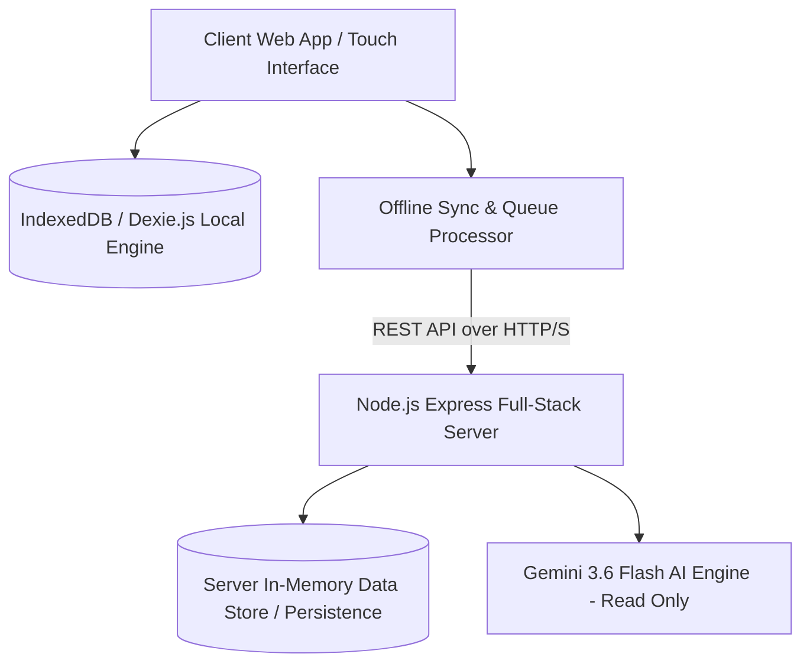
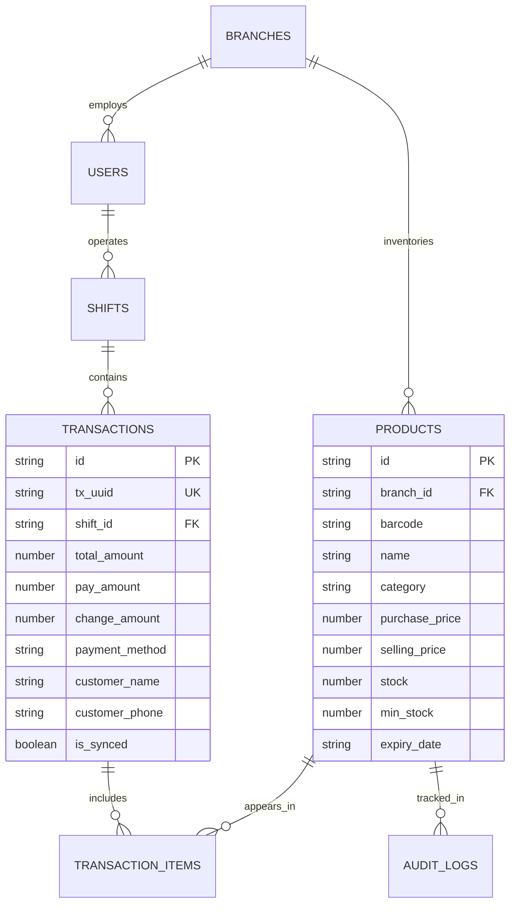

# Software Requirements Specification (SRS)
## RetailFlow POS - Modern Web-Based Point of Sale System

**Document Version:** 1.0.0  
**Document Status:** Final Engineering Blueprint  
**Project Name:** RetailFlow POS  
**Architecture:** Offline-First Progressive Web Application (PWA) with Full-Stack Express Server  

---

## 1. System Overview & Technology Stack

### 1.1 Architecture Blueprint
RetailFlow POS is structured as a layered, modular full-stack web application designed for maximum reliability and offline resilience.



### 1.2 Technology Selection Matrix

| Layer | Technology | Rationale |
| :--- | :--- | :--- |
| **Frontend Framework** | React 19 + Vite | High rendering efficiency, lightweight bundle size, instant startup. |
| **Styling** | Tailwind CSS v4 + Motion | Mobile-first utility classes, high performance fluid animations. |
| **Icons** | Lucide React | Modern, clear, touch-accessible visual symbols. |
| **Client Storage** | Dexie.js (IndexedDB wrapper) | Transactional client-side storage for offline checkout & local caching. |
| **Server Framework** | Express.js + Node.js (via tsx) | Lightweight API endpoints for server verification, AI integration, and persistence. |
| **AI Analytics** | `@google/genai` (Gemini 3.6 Flash) | Fast, server-side read-only business insights and inventory predictions. |

---

## 2. Directory Structure & Module Boundaries

```
retailflow-pos/
├── metadata.json
├── PRD.md
├── SRS.md
├── package.json
├── server.ts                  # Express Backend Entry point & API Handlers
├── vite.config.ts
├── index.html
└── src/
    ├── main.tsx
    ├── App.tsx
    ├── index.css
    ├── types.ts              # System Domain Types & Interfaces
    ├── db/
    │   ├── dexie.ts          # IndexedDB Local Engine Schema
    │   └── seed.ts           # Demo Catalog & Initial Data Seed
    ├── services/
    │   ├── api.ts            # Client API Client & Offline Sync Queue Engine
    │   └── ai.ts             # Client AI Bridge
    ├── store/
    │   └── useStore.ts       # Application State & Active Shift Manager
    ├── components/
    │   ├── layout/
    │   │   ├── Navigation.tsx
    │   │   └── Header.tsx
    │   ├── pos/
    │   │   ├── CashierPOS.tsx
    │   │   ├── CartDrawer.tsx
    │   │   ├── OpenShiftModal.tsx
    │   │   ├── CloseShiftModal.tsx
    │   │   └── ReceiptModal.tsx
    │   ├── inventory/
    │   │   ├── ProductList.tsx
    │   │   ├── ProductFormModal.tsx
    │   │   ├── StockOpnameModal.tsx
    │   │   └── StockPurchaseModal.tsx
    │   ├── finance/
    │   │   ├── CashflowManager.tsx
    │   │   └── ExpenseModal.tsx
    │   ├── reports/
    │   │   └── ReportsDashboard.tsx
    │   ├── ai/
    │   │   └── AIAssistantDrawer.tsx
    │   └── common/
    │       ├── StatCard.tsx
    │       ├── ResponsiveTable.tsx
    │       └── SyncBadge.tsx
    └── utils/
        ├── formatters.ts
        └── pdfGenerator.ts
```

---

## 3. Database Schema & Data Models

### 3.1 Data Model ERD



### 3.2 TypeScript Interfaces (`src/types.ts`)

```typescript
export type UserRole = 'OWNER' | 'MANAGER' | 'CASHIER';

export interface User {
  id: string;
  name: string;
  email: string;
  role: UserRole;
  branchId: string;
}

export interface Product {
  id: string;
  branchId: string;
  barcode: string;
  name: string;
  brand: string;
  category: string;
  description: string;
  purchasePrice: number;
  sellingPrice: number;
  taxPercent: number;
  stock: number;
  minStock: number;
  expiryDate: string;
  supplierName?: string;
  isAvailable: boolean;
  createdAt: string;
  updatedAt: string;
}

export interface CartItem {
  product: Product;
  quantity: number;
  discountAmount: number;
  subtotal: number;
}

export type PaymentMethod = 'CASH' | 'QRIS' | 'BANK_TRANSFER';

export interface Transaction {
  id: string;
  txUuid: string;
  branchId: string;
  shiftId: string;
  cashierId: string;
  cashierName: string;
  items: CartItem[];
  subtotal: number;
  taxTotal: number;
  discountTotal: number;
  grandTotal: number;
  payAmount: number;
  changeAmount: number;
  paymentMethod: PaymentMethod;
  customerName?: string;
  customerPhone?: string;
  status: 'COMPLETED' | 'REFUNDED' | 'CANCELLED';
  isSynced: boolean;
  createdAt: string;
}

export interface Shift {
  id: string;
  branchId: string;
  cashierId: string;
  cashierName: string;
  openingCash: number;
  expectedClosingCash?: number;
  actualClosingCash?: number;
  cashDifference?: number;
  startTime: string;
  endTime?: string;
  status: 'OPEN' | 'CLOSED';
  notes?: string;
}

export interface AuditLog {
  id: string;
  branchId: string;
  userId: string;
  userName: string;
  action: string;
  module: string;
  details: string;
  timestamp: string;
}
```

---

## 4. REST API Endpoint Specification

All API routes are served under `/api/*` on port 3000.

| Method | Endpoint | Auth Required | Description |
| :--- | :--- | :---: | :--- |
| `GET` | `/api/health` | Public | System health & server connectivity status check |
| `GET` | `/api/products` | Yes | List all catalog items for active branch |
| `POST` | `/api/products` | Owner/Manager | Add a new SKU to product catalog |
| `PUT` | `/api/products/:id` | Owner/Manager | Update product details or stock |
| `DELETE`| `/api/products/:id` | Owner | Soft delete SKU from catalog |
| `POST` | `/api/transactions/sync` | Yes | Bulk sync local transactions from client queue |
| `GET` | `/api/shifts/active` | Yes | Get active cashier shift details |
| `POST` | `/api/shifts/open` | Yes | Open cashier shift with initial opening cash |
| `POST` | `/api/shifts/close` | Yes | Close shift, reconcile cash difference |
| `POST` | `/api/ai/insights` | Owner/Manager | Generate Gemini AI business analytics (Read-Only) |
| `GET` | `/api/audit-logs` | Owner | Retrieve non-deletable system audit trail |

---

## 5. Offline Architecture & Background Sync Engine

### 5.1 Dexie.js Schema Configuration
```typescript
import Dexie, { Table } from 'dexie';
import { Product, Transaction, Shift, AuditLog } from '../types';

export interface PendingSyncItem {
  id?: number;
  txUuid: string;
  payload: Transaction;
  status: 'PENDING' | 'SYNCED' | 'FAILED';
  retryCount: number;
  timestamp: string;
}

export class RetailFlowDatabase extends Dexie {
  products!: Table<Product>;
  transactions!: Table<Transaction>;
  shifts!: Table<Shift>;
  auditLogs!: Table<AuditLog>;
  syncQueue!: Table<PendingSyncItem>;

  constructor() {
    super('RetailFlowLocalDB');
    this.version(1).stores({
      products: 'id, barcode, category, name',
      transactions: 'id, txUuid, shiftId, isSynced, createdAt',
      shifts: 'id, status, cashierId',
      auditLogs: 'id, timestamp, module',
      syncQueue: '++id, txUuid, status, timestamp'
    });
  }
}

export const db = new RetailFlowDatabase();
```

### 5.2 Conflict Resolution & Retry Rules
* **Deduplication:** Server checks `txUuid`. If existing `txUuid` is present in server memory, server acknowledges receipt with `200 OK` without duplicating sales figures.
* **Network Recovery Listener:** Frontend attaches `window.addEventListener('online', processSyncQueue)`.
* **Exponential Backoff:** Failed items retry up to 5 times.

---

## 6. AI Assistant Integration (Gemini 3.6 Flash)

The server initializes `@google/genai` using the official recommended pattern:

```typescript
import { GoogleGenAI } from "@google/genai";

const ai = new GoogleGenAI({
  apiKey: process.env.GEMINI_API_KEY,
  httpOptions: {
    headers: { 'User-Agent': 'aistudio-build' }
  }
});

// Example Read-Only Insight Call
export async function getRetailInsights(salesData: any, stockData: any) {
  const response = await ai.models.generateContent({
    model: "gemini-3.6-flash",
    contents: `Analyze these minimarket sales and inventory figures and output concise JSON business insights:
    Sales Summary: ${JSON.stringify(salesData)}
    Low Stock List: ${JSON.stringify(stockData)}`,
    config: {
      systemInstruction: "You are an expert minimarket retail strategist. Provide actionable, read-only sales predictions and stock recommendations.",
      responseMimeType: "application/json"
    }
  });
  return JSON.parse(response.text || '{}');
}
```

---

## 7. Security & Non-Functional Verification

* **Strict Input Validation:** All API endpoints validate request payloads.
* **Non-Deletable Audit Logs:** Audit table records have no update/delete routes exposed.
* **Touch Interface Compliance:** Cashier controls verify standard touch sizes ($\ge 48\text{px}$).

---

## 8. Document Sign-Off
* **Technical Lead:** Senior Software Architect
* **Build Target:** Complete Full-Stack Web Execution.
